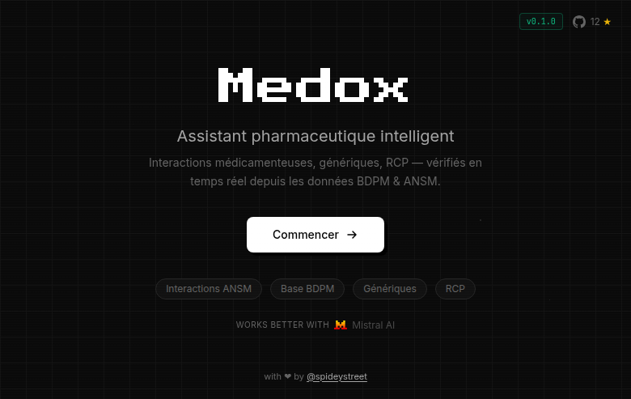

<div align="center">

# Medox

**AI-powered drug interaction checker for French healthcare professionals.**

Built on official BDPM & ANSM data. Powered by Mistral.

<p>
  
  
  
  
</p>



</div>

## What it does

You ask a question about a drug — Medox queries the official French databases in real-time and gives you a sourced answer.

- **Interaction checking** — cross-references the ANSM Thesaurus (contraindications, precautions)
- **Generic lookup** — finds all generics for a given drug via BDPM
- **RCP access** — retrieves the official Summary of Product Characteristics

The agent never guesses. Every answer comes with CIS codes and ANSM constraint levels.

## Quickstart

```bash
uv sync && cp .env.example .env
docker compose up -d
uv run dotenv -f .env run -- uv run dagster asset materialize --select '*'
uv run dotenv -f .env run -- uv run langgraph dev
```

Frontend at `localhost:5177` — Backend at `localhost:2024`

## Stack

```
BDPM + ANSM → Dagster → dbt (PostgreSQL) → ChromaDB → LangGraph ReAct Agent → React Frontend
```

> **Disclaimer:** Medox is experimental. It does not replace professional medical advice.
