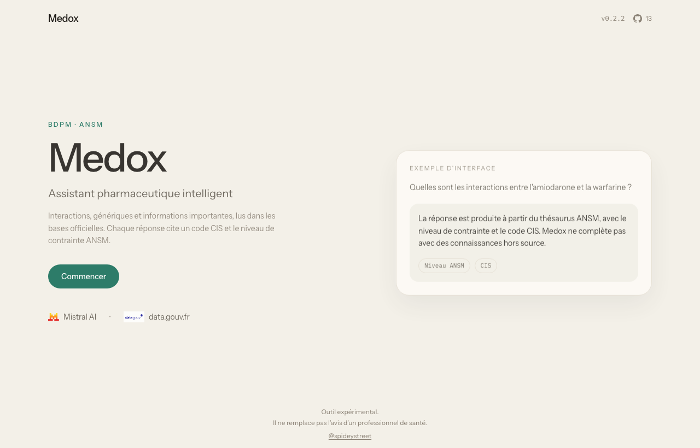

<div align="center">

# Medox

**Drug interaction checker for French healthcare professionals.**

Built on official BDPM and ANSM data. Powered by Mistral.

<p>
  
  
  
  
</p>



</div>

## What it does

You ask about a drug. Medox looks it up in the indexed official databases and answers with the source.

- **Interactions** — ANSM thesaurus levels (contraindication, precaution, and the rest)
- **Generics** — BDPM generic group for a CIS code
- **Safety notices** — ANSM alerts linked from the BDPM, with the URL

Every drug mention carries a CIS code. A contraindication or a discouraged association is prefixed on the answer. The model does not fill gaps the tools did not return.

The ANSM thesaurus edition is frozen (15 September 2023). BDPM files are refreshed monthly.

## Quickstart

```bash
uv sync && cp .env.example .env
docker compose up -d
uv run dotenv -f .env run -- uv run dagster asset materialize --select '*'
uv run dotenv -f .env run -- uv run uvicorn medox.api.app:app --host 0.0.0.0 --port 2024
cd frontend && npm install && npm run dev
```

Set `MISTRAL_API_KEY` or `OPENROUTER_API_KEY` in `.env`. Visitors do not bring a key.

Frontend at `localhost:5177` — API at `localhost:2024`

## Stack

```
BDPM + ANSM → Dagster → dbt (PostgreSQL) → ChromaDB → FastAPI (Mistral) → React
```

> **Disclaimer:** Medox is experimental. It does not replace professional medical advice.
